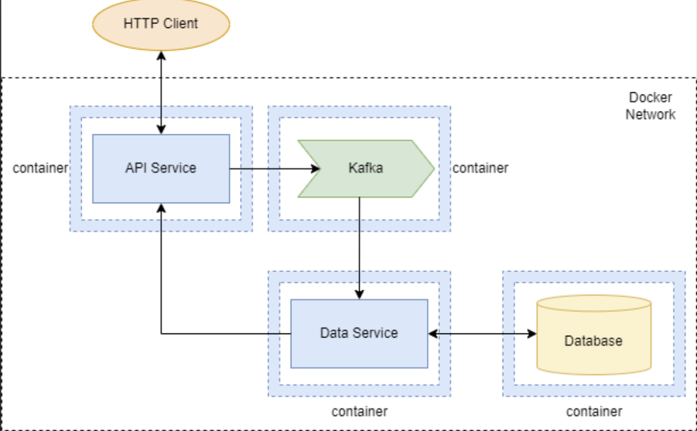

# post-n-comment
Учебный проект по предмету "Основы клауд компьютинга"\
[задание](https://github.com/Jho00/cloud-computing/tree/main/labs/Kafka)
### Цель работы:
Разработать систему на основе микросервисной архитектуры с 
использованием технологий контейнеризации, базы данных, 
брокера сообщений и веб-сервисов

### Компоненты системы
- Api service
- Data service
- Database
- Kafka

Каждый компонент запускается в Docker-контейнере в пределах Docker-сети. 
Для конфигурирования образов и контейнеров используется docker-compose, файлы Dockerfile.

Диаграмма:

## Описание функциональности компонентов
**API Service**

Предоставляет HTTP API для доступа извне Docker-сети. HTTP API содержит следующие конечные точки:

- Добавления новой порции данных. Порция данных отправляется в Kafka.
- Поиск по добавленным порциям данных. Поиск производится путем обращения к конечной точке HTTP API Data Service.
- Получение отчетов на основе добавленных данных. Получение отчетов производится путем обращения к конечной точке HTTP API Data Service.

**Data Service** 

Получает из Kafka порции данных для записи, записывает их в БД. Предоставляет HTTP API со следующими конечными точками:

- Поиск по добавленным порциям данных. Поиск производится путем выборки из БД.
- Получение отчетов на основе добавленных данных. Получение отчетов производится путем выборки из БД с использованием агрегации и т.п.

## Instruction to getting start
1. Склонируйте репозиторий\
`git clone https://github.com/aWatLove/post-n-comment.git`
2. Смените директорию\
`cd post-n-comment`
3. Build and run docker `docker-compose up --build`
4. После запуска всех контейнеров, можно протестировать API\
`localhost:8080/swagger/index.html#/`

### Стек технологий
- Golang, Gin, GORM
- PostgreSQL
- Kafka
- Docker, docker compose
- Swagger

## Как улучшить сервис?

- Переделать подключение к кафке в сервисах по "best practice"
- Добавить кеш
- Покрыть сервисы unit-, mock- и стресс- тестами